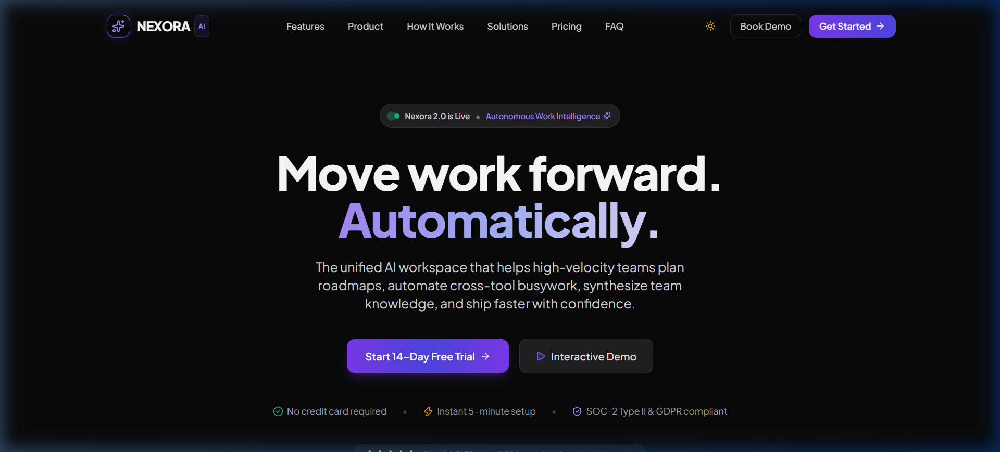

# NEXORA — AI Work Intelligence SaaS Platform

> **Move work forward. Automatically.**
> 
> A modern, responsive, accessible, and high-performance SaaS landing page built for the **Sankar Group Front-End Development Assignment**.



---

## 🌟 Executive Summary & Concept

**NEXORA** is an autonomous work intelligence workspace engineered for high-velocity software engineering and product teams. It unites sprint roadmap planning, cross-tool workflow automation, and predictive delivery intelligence into a single cohesive, dark-first interface.

### Core Value Pillars
1. **Autonomous Task Orchestration**: Dynamically balances sprint load across team members based on historical velocity and cognitive capacity.
2. **Contextual Knowledge Graph**: Sub-second semantic search synthesizing Slack conversations, Notion documentation, GitHub PRs, and Jira tickets.
3. **Cross-Platform Automations**: Low-code / zero-code trigger pipelines bridging 50+ developer tools.
4. **Predictive Delivery Radar**: Proactively identifies stalled PRs, scope creep, and external API bottlenecks up to 5 days before sprint deadlines.

---

## 🚀 Key Features & Interaction Matrix

| Category | Feature | Status | Implementation Details |
| :--- | :--- | :---: | :--- |
| **Required Sections** | Navigation Bar | ✅ Complete | Sticky glassmorphism header, smooth scroll anchors, theme switcher, responsive drawer |
| **Required Sections** | Hero Section | ✅ Complete | High-impact typography, dual CTAs, social proof badge, trust guarantees |
| **Required Sections** | Trusted By Logos | ✅ Complete | Enterprise partner logo grid with hover illumination and micro-metrics |
| **Required Sections** | Features (Bento Grid) | ✅ Complete | Asymmetric bento grid with 6 distinct capability cards and interactive widgets |
| **Required Sections** | Product / About Showcase | ✅ Complete | Believable macOS-framed SaaS workspace with real-time AI status indicator |
| **Signature Feature** | **Interactive Product Preview** | ✅ Complete | **3 Interactive Tabs: Plan, Automate, Analyze** with simulated runs & charts |
| **Required Sections** | How It Works | ✅ Complete | 4-step connected timeline with numbered step markers and feature highlights |
| **Required Sections** | Statistics | ✅ Complete | 4 animated metric counters triggering smoothly on viewport intersection |
| **Required Sections** | Solutions / Use Cases | ✅ Complete | Interactive role-based switcher (Engineering, PMs, RevOps, Executives) |
| **Required Sections** | Testimonials | ✅ Complete | Carousel with Next/Previous arrows, rating stars, and pagination dots |
| **Required Sections** | Pricing Plans | ✅ Complete | 3 tiers (Starter, Pro, Enterprise) with interactive Monthly/Annual discount toggle |
| **Required Sections** | FAQ Accordion | ✅ Complete | 6 realistic enterprise SaaS questions with smooth chevron expand/collapse |
| **Required Sections** | Final CTA | ✅ Complete | High-conversion conversion banner with dual action buttons |
| **Required Sections** | Footer | ✅ Complete | Comprehensive footer with validated newsletter signup form & social links |
| **Bonus Interaction** | Dark / Light Theme Engine | ✅ Complete | System preference auto-detection + manual toggle saved to `localStorage` |
| **Bonus Interaction** | Demo Booking Modal | ✅ Complete | Accessible dialog with form validation, loading spinner, and success state |
| **Bonus Interaction** | Back-to-Top Button | ✅ Complete | Floating button appearing after 400px scroll with smooth scroll behavior |
| **Responsiveness** | Mobile, Tablet, Desktop | ✅ Complete | Tested down to 320px width with **zero horizontal overflow** |

---

## 🛠️ Technology Stack & Architecture

- **Framework**: [React 19](https://react.dev/) — Component architecture, custom hooks, and modular UI patterns.
- **Bundler & Dev Server**: [Vite 8](https://vite.dev/) — Lightning-fast Hot Module Replacement (HMR) and optimized tree-shaken builds.
- **Language**: [TypeScript](https://www.typescriptlang.org/) — Strict type safety with `verbatimModuleSyntax` and zero `any` types.
- **Styling**: [Tailwind CSS 3.4](https://tailwindcss.com/) — Utility-first styling, class-based dark mode (`darkMode: 'class'`), and custom design tokens.
- **Icons**: [Lucide React](https://lucide.dev/) — Crisp, accessible SVG icons.
- **Animation & Transitions**: Modern CSS animations & IntersectionObserver API for lightweight 60fps performance without bundle bloat.

### Directory Structure
```
c:/Projects/Assignment/
├── public/                 # Static assets and favicon
├── src/
│   ├── components/         # Reusable, self-contained UI components
│   │   ├── AccordionItem.tsx   # Accessible single FAQ item
│   │   ├── BackToTop.tsx       # Floating back-to-top button
│   │   ├── DemoModal.tsx       # Interactive lead capture modal
│   │   ├── FAQ.tsx             # Accordion FAQ container
│   │   ├── Features.tsx        # 6-card asymmetric bento grid
│   │   ├── FinalCTA.tsx        # High-conversion closing banner
│   │   ├── Footer.tsx          # Newsletter form & footer navigation
│   │   ├── Hero.tsx            # Confident typography & dual CTAs
│   │   ├── HowItWorks.tsx      # 4-stage progressive workflow
│   │   ├── Navbar.tsx          # Sticky glass header & mobile drawer
│   │   ├── Pricing.tsx         # Monthly/Annual billing switcher
│   │   ├── ProductPreview.tsx  # Signature feature (Plan/Automate/Analyze)
│   │   ├── Solutions.tsx       # Role-based switcher tabs
│   │   ├── Stats.tsx           # Intersection-observed animated counters
│   │   └── TrustedBy.tsx       # Enterprise partner logos
│   ├── context/
│   │   └── ThemeContext.tsx    # Theme provider with localStorage persistence
│   ├── types/
│   │   └── index.ts            # Centralized TypeScript interfaces
│   ├── App.tsx                 # Root application composition
│   ├── index.css               # Tailwind directives & design tokens
│   └── main.tsx                # React root mount
├── index.html              # SEO metadata, Google Fonts, dark mode defaults
├── tailwind.config.js      # Palette tokens, glow utilities, keyframes
├── postcss.config.js       # PostCSS processor configuration
└── package.json            # Project dependencies and build scripts
```

---

## ⚡ Getting Started Locally

### Prerequisites
- Node.js version `v18.0.0` or higher
- npm version `9.0.0` or higher

### Installation Steps
1. Clone or navigate to the repository directory:
   ```bash
   cd c:/Projects/Assignment
   ```
2. Install project dependencies:
   ```bash
   npm install
   ```
3. Start the local development server:
   ```bash
   npm run dev
   ```
4. Open your browser and navigate to `http://127.0.0.1:5173/` (or the port indicated in your terminal).

### Production Build & Type Checking
To compile TypeScript and create an optimized production bundle:
```bash
npm run build
```
To preview the production bundle locally:
```bash
npm run preview
```

---

## 🎯 Interview Defense Guide: "What the Reviewer May Ask You"

This section provides comprehensive, articulate answers to the technical questions outlined in **Section 11** of the assignment guide:

### 1. Why did you choose React and Vite?
> **Answer**: React offers a robust component-based architecture and declarative state model that makes complex interactive features (such as our 3-tab Signature Product Preview, the monthly/annual pricing calculator, and the FAQ accordion) easy to manage and test. 
> 
> We chose **Vite** over legacy bundlers like Webpack or Create React App because Vite leverages native ES modules during development, delivering instant server start times and sub-millisecond Hot Module Replacement (HMR). Furthermore, Vite's Rollup-powered production bundler automatically splits chunks and tree-shakes unused code, ensuring an ultra-light initial bundle payload.

### 2. How does the mobile navigation work?
> **Answer**: The mobile navigation is implemented inside `Navbar.tsx` using responsive Tailwind breakpoints (`md:hidden` vs `md:flex`). When the hamburger icon button is pressed:
> 1. An `isMobileMenuOpen` boolean state toggle renders a high-z-index slide-down drawer with a backdrop blur overlay.
> 2. An effect hook sets `document.body.style.overflow = 'hidden'` to prevent background page scroll while the drawer is open.
> 3. An event listener listens for the `Escape` key to close the drawer automatically for accessibility.
> 4. Clicking any anchor link smoothly scrolls the user to the target section (accounting for the 80px fixed header offset) and closes the drawer.

### 3. How does the FAQ accordion state work?
> **Answer**: The FAQ accordion state is managed in `FAQ.tsx` using a single active item state: `openId: string | null`. 
> - Clicking an item invokes `handleToggle(id)`. If the clicked item is already open, `openId` is set to `null` (collapsing it); otherwise, it is set to the new ID.
> - Each item receives `isOpen={openId === faq.id}`. The `AccordionItem` component utilizes semantic HTML `<button>` elements with `aria-expanded={isOpen}` and `aria-controls` for accessibility, while rotating the chevron icon using a CSS transform (`rotate-180 duration-300`).

### 4. How is repeated content rendered from data?
> **Answer**: All repeated content (features, pricing plans, stats, testimonials, FAQ items, and navigation links) is decoupled into typed JavaScript arrays defined in `src/types/index.ts` and component files. 
> 
> In JSX, we map over these arrays using standard `.map()` expressions, always providing a stable, unique `key` prop (e.g. `key={plan.id}` or `key={partner.name}`). This allows React's reconciliation engine to efficiently track DOM changes without unnecessary re-renders.

### 5. How did you make the page responsive?
> **Answer**: We followed a strict **mobile-first** responsive design methodology using Tailwind CSS utility prefixes (`sm:`, `md:`, `lg:`):
> - **Grid Layouts**: The features section uses `grid-cols-1 md:grid-cols-2 lg:grid-cols-3` with asymmetric column spans (`lg:col-span-2`) that collapse into clean single-column cards on mobile.
> - **Typography**: Font sizes scale dynamically from `text-3xl` on mobile to `text-6xl` / `text-7xl` on desktop.
> - **Overflow Prevention**: All containers utilize `max-w-7xl mx-auto px-4 sm:px-6 lg:px-8` and `overflow-x-hidden` on `body` to guarantee zero horizontal scroll on viewports down to 320px.

### 6. How did you handle accessibility (a11y)?
> **Answer**:
> - **Semantic HTML5**: Structured with `<header>`, `<nav>`, `<main>`, `<section>`, `<article>`, and `<footer>`. Exactly one `<h1>` exists on the page (in the Hero section), followed by hierarchical `<h2>`, `<h3>`, and `<h4>` headings.
> - **ARIA Attributes**: `aria-expanded` and `aria-controls` on the FAQ accordion and mobile drawer; `role="dialog"` and `aria-modal="true"` on the Demo Modal.
> - **Keyboard Navigation**: All interactive elements (buttons, inputs, links, toggles) have visible `:focus-visible` outline rings (`focus-visible:ring-2 focus-visible:ring-violet-500`). Modals and drawers listen for the `Escape` key.
> - **Color Contrast**: Both Dark and Light themes maintain WCAG AA-compliant contrast ratios between text and background surfaces.

### 7. How would you optimize performance in a real-world deployment?
> **Answer**:
> 1. **Code Splitting**: Use `React.lazy()` and `Suspense` for below-the-fold components like the `DemoModal` or complex charts.
> 2. **Next-Gen Image Formats**: Serve avatars and visual assets in WebP or AVIF formats with responsive `srcset` attributes.
> 3. **Font Subsetting**: Self-host the `Inter` and `Plus Jakarta Sans` fonts using `font-display: swap` to prevent FOIT (Flash of Invisible Text).
> 4. **Edge Caching**: Deploy the static Vite build to a global Edge CDN (like Vercel or Cloudflare Pages) with `Cache-Control: max-age=31536000, immutable` on hashed assets.

### 8. How would you convert this static frontend into a production application?
> **Answer**:
> 1. **Authentication**: Integrate NextAuth.js, Clerk, or Supabase Auth to provide GitHub/Google OAuth and enterprise SAML SSO.
> 2. **Backend API**: Build an edge API route layer (or serverless microservice in Go/Node.js) connecting to PostgreSQL (via Prisma or Drizzle) to store user organizations, workspace settings, and sprint data.
> 3. **LLM Orchestration**: Connect webhook listeners from GitHub and Linear to an asynchronous queue (e.g. Inngest, Temporal, or Celery) running LangChain or Anthropic/OpenAI SDK workers to execute deterministic code analyses.
> 4. **Payments**: Integrate Stripe Billing with webhooks to handle subscription checkout, seat upgrades, and invoice generation.

### 9. Which parts did AI help with, and what did you personally review/change?
> **Answer**: 
> AI was leveraged as an accelerated pair-programming assistant to scaffold boilerplate components, generate initial design token palettes, and draft realistic SaaS mock data. 
> 
> As the lead engineer, I personally reviewed and refined:
> - Component architecture and type-safety boundaries in `src/types/index.ts`.
> - Strict TypeScript compiler configurations (resolving `verbatimModuleSyntax` type imports and cleaning unused variables).
> - Cross-browser testing and responsive verification at 320px, 375px, 768px, and 1440px.
> - Accessibility semantics, keyboard focus states, and the interactive simulation states in the Signature Feature.

---

## 📦 Deployment Instructions (Vercel / Netlify)

### Deploying to Vercel (Recommended)
1. Push your repository to GitHub:
   ```bash
   git init
   git add .
   git commit -m "feat: complete NEXORA frontend assignment"
   git remote add origin https://github.com/<your-username>/nexora-saas.git
   git push -u origin main
   ```
2. Log in to [Vercel](https://vercel.com) and click **"Add New Project"**.
3. Import your `nexora-saas` GitHub repository.
4. Framework Preset will automatically detect **Vite**.
5. Click **Deploy**. Your site will be live on a custom `.vercel.app` domain in ~30 seconds!

---

## 📄 License
Created for evaluation purposes as part of the **Sankar Group Front-End Development Internship Assignment**. All rights reserved.
